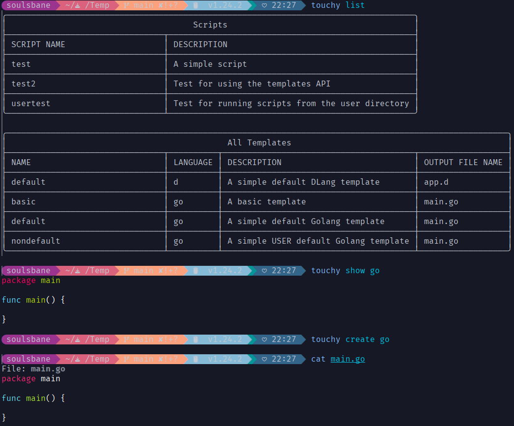

# Description

Creates a file based upon a programming language template. Essentially touch but with added powers.

## Example Terminal Output



## Commands

All commands take a programming language and the template name as arguments for the most part. In most cases the template name can be omitted.

## Create

Creates a new file based on a template. The example below creates a file based on the default 'go' language template.

```text
touchy create go
```

You can also provide a template name after the language name to create a specific template:

```text
touchy create go main
```

## List

List all available programming languages and/or templates of a programming language. The example below lists all programming languages.

```text
touchy list all
```

To get a list of a programming languages templates use the following command example

```text
touchy list go
```

## Show

Displays the colorized contents of a template to the terminal.
Example that will show the contents of the default go template

```text
touchy show go
```

You can also provide a template name after the language name to show a specific template

```text
touchy show go main
```

